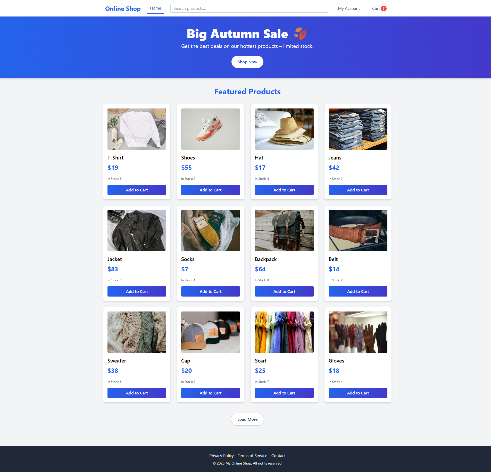
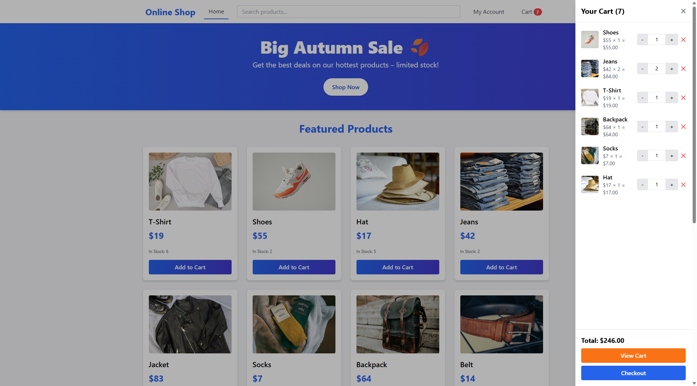

# 🛒 React E-Commerce Shop

A modern, responsive e-commerce web application built with **React**, **Tailwind CSS**, and **React Router**.  
This project demonstrates a full shopping experience including product listing, product details, cart management, checkout with account options, and user authentication.

---

  
  
  

## 🌟 Features

### Products & Shopping
- Display products in a responsive grid layout.
- Product detail pages with images, descriptions, and stock information.
- Add to cart with quantity management.
- Low stock & out-of-stock indicators.
- "Load More" functionality for featured products.

### Cart & Checkout
- Cart sidebar accessible from any page.
- Increment, decrement, or remove items from cart.
- Checkout form with guest, registered, and account creation options.
- Payment method selection and form validation.
- Order summary with dynamic total.
- Persistent cart using `localStorage`.

### User Accounts
- Sign Up & Sign In pages.
- Protected "My Account" page with:
  - Profile info
  - Change password
  - Address management
  - Payment information
  - Purchase history
- Users stored in `localStorage` (simulated backend).

### Contact & Support
- Contact form with validation and confirmation messages.
- Embedded Google Map for address display.

### Routing
- Fully functional routing using **React Router v6**.
- Public and protected routes.
- Custom 404 Not Found page with navigation options.

### Styling
- Responsive design using **Tailwind CSS**.
- Gradient buttons, hover effects, and card layouts.
- Clean and modern UI/UX.

---

## 🛠️ Tech Stack

- **React** (Functional components & Hooks)  
- **React Router v7**  
- **Tailwind CSS** for styling  
- **localStorage** for persistence (cart & user data)  
- **JavaScript ES6+**

---

## 💻 Usage

- Browse featured products on the homepage.  
- Click a product to view details and select a shipping method.  
- Add items to the cart and manage quantities.  
- Proceed to checkout as a guest or registered user.  
- Register an account to save purchase history and manage your profile.  
- Contact via the Contact page for support.

---

## 🔐 Authentication Flow

- **Sign Up** creates a new user in `localStorage`.  
- **Sign In** validates against stored users.  
- Protected routes (like My Account) require authentication.  
- Public routes redirect signed-in users to `/myaccount`.

---

## 📌 Notes

- This project uses `localStorage` to simulate a backend. In a real-world app, connect to a proper API.  
- All forms include front-end validation.  
- Cart and user session persist across page refreshes.

---

## 🚀 Future Improvements

- Connect to a real backend (Node.js/Express + MongoDB or Firebase).  
- Add real payment processing (Stripe/PayPal).  
- Implement product search, filters, and categories.  
- Add animations and enhanced mobile UX.

---

## 📄 License

This project is open-source and available under the **MIT License**.
